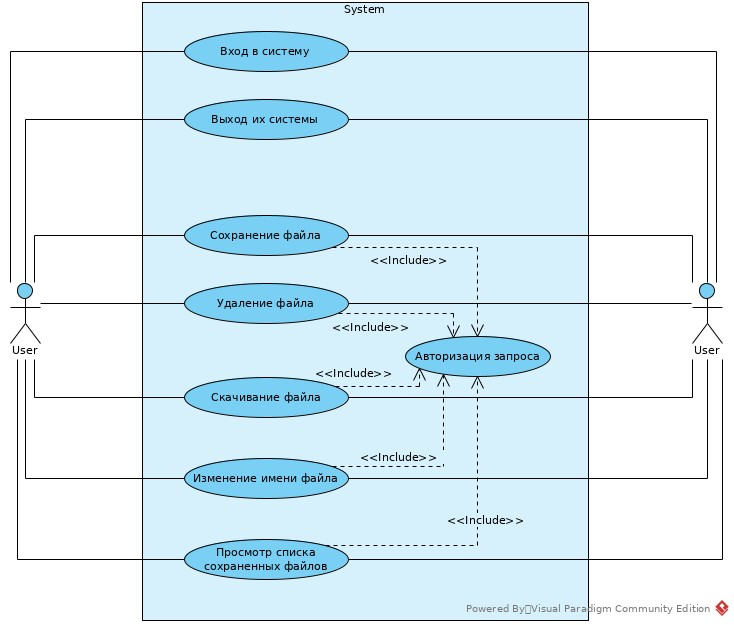
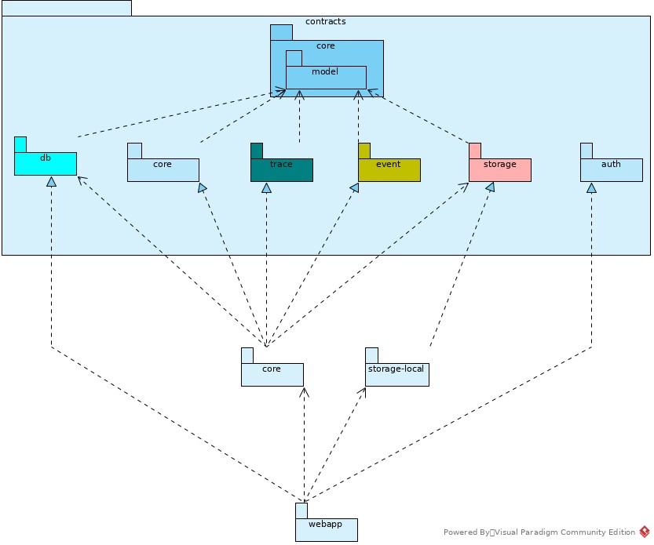
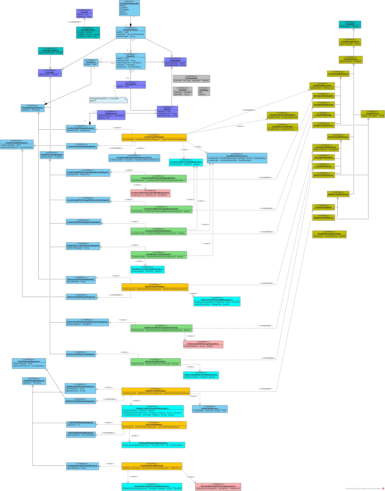
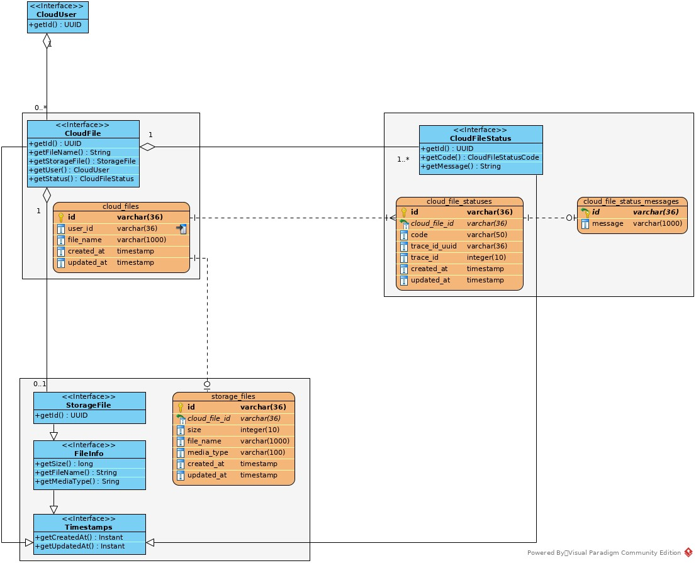
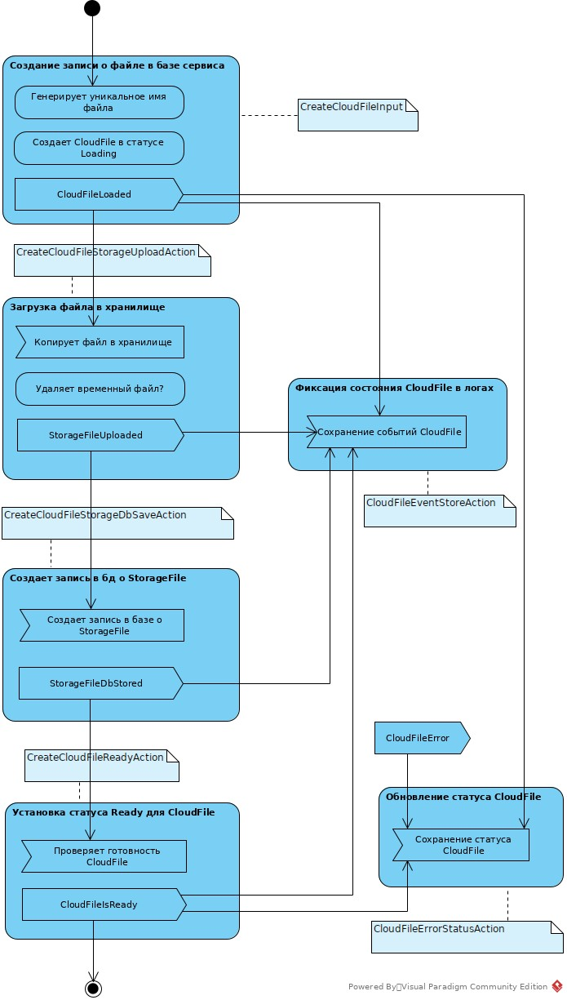
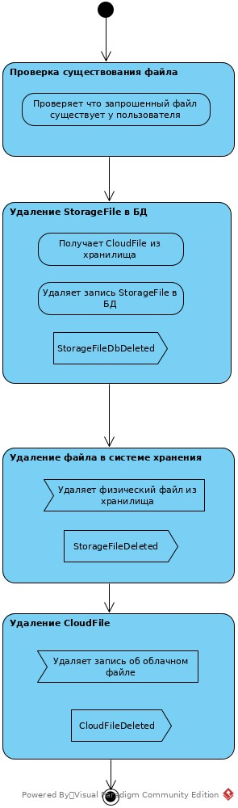

<!-- TOC -->
* [Cloudstorage Service](#cloudstorage-service)
* [Требования к программному обеспечению](#требования-к-программному-обеспечению)
    * [Зависимости Сборки из исходных кодов](#зависимости-сборки-из-исходных-кодов)
* [Демо приложение](#демо-приложение)
* [Сборка из исходных кодов и запуск](#сборка-из-исходных-кодов-и-запуск)
* [Архитектура проекта](#архитектура-проекта)
<!-- TOC -->

# Cloudstorage Service

Сервис предоставляет REST-интерфейс для загрузки файлов и вывода списка уже загруженных файлов пользователя.

Все запросы к сервису авторизованы. Заранее подготовленное веб-приложение (FRONT) подключается к
разработанному сервису без доработок, а также использует функционал FRONT для авторизации, загрузки и вывода списка
файлов пользователя.

Подробнее задание на разработку см [TASK.md](TASK.md)

Описание API Rest взаимодействия доступно в формате OpenAPI [openapi.yaml](doc/openapi.yaml)

# Требования к программному обеспечению

* Java 17+ Runtime
* PostgreSQL 14+
* Docker 24+ с плагином compose (опционально)

### Зависимости Сборки из исходных кодов

* Java 17+ SDK
* Apache Maven 3.9.5
* Docker 24+
* GNU Make 4.3+ (опционально)
* Доступ в интернет

# Демо приложение

Для демонстрации возможностей приложения в проекте предусмотрено полностью сконфигурированная и готовая структура
с использованием docker. Для запуска демо приложения следует:

* Создайте в корне проекта `.env` файл по примеру `.env.example`
* В нем укажите желаемые настройки, за исключением DOCKER_IMAGE_EXPOSE, WEBAPP_VERSION.
* Запустите демо приложение командой `docker compose up -d`. Все нужные образы будут загружаться
  с [DockerHub](https://hub.docker.com/)
* Веб интерфейс доступен по адресу `http://localhost:88`, где порт 88 зависит от конфигурационного параметра FRONT_PORT
* Rest сервис доступен по адресу `http://localhost:5500`. В версии 1.0.0 демо приложения порт не может быть изменен
* Пользователь демо приложения `user@example`, пароль `123456`

# Сборка из исходных кодов и запуск

* Нужно клонировать репозиторий и перейти в корень проекта
* Запустить `mvn package`
* Если не возникло ошибок, то в подпапке `webapp/target` будет создан файл `cloudstorage-webapp-1.0.0.jar`
* Проект использует реляционную базу данных PostgreSQL, запускаемую на локальном порту `10.100.105.150:5432`. Базу
  данных можно
  запустить через `docker compose`. Для этого в корне проекта создайте `.env` файл по примеру `.env.example` и выполните
  в консоли `docker compose up -d`.
* Для запуска приложения следует выполнить команду `java -jar ./webapp/target/cloudstorage-webapp-1.0.0.jar`
* Будет запущено консольное приложение
* Приложение сконфигурировано с пользователем `user@example`, пароль `123456`

В проекте также используется maven wrapper и утилита make (с командами clean, build, run и др). Для использования данных
утилит требуется создать файл `.env` по примеру [.env.example](.env.example)

# Архитектура проекта

Реализуемые приложением сценарии представлены диаграммой

Основываясь [на задании](./TASK.md) и принципе "Чистой архитектуры", описанном
в [Clean Architecture with Spring Boot](https://www.baeldung.com/spring-boot-clean-architecture),
автор разделил приложение на следующие модули:

1. **contracts** - описание интерфейсов предметной области. Содержит стабильные и абстрактные соглашения о сущностях
   проекта. Использует только средства стандартной библиотеки Java 17.
    * [contracts-auth](contracts-auth) Интерфейсы поддомена авторизации
    * [contracts-core](contracts-core) Интерфейсы компонентом и сценариев основного поддомена предметной области -
      обработка запросов манипуляции с файлами
    * [contracts-core-model](contracts-core-model) - Интерфейсы моделей предметной области
    * [contracts-db](contracts-db) - Интерфейсы репозиториев хранения информации о файлах
    * [contracts-event](contracts-event) - Интерфейсы событийного аспекта предметной области
    * [contracts-storage](contracts-storage) - Интерфейсы физического хранения файлов сервиса
    * [contracts-trace](contracts-trace) - Интерфейсы трасировки выполняемых запросов сервиса
2. [core](core) - состоит из реализаций сущностей предметной области и пользовательских сценариев.
   Как стороннюю зависимость использует библиотеку Lombok.
3. [storage-local](storage-local) - финальные реализации интерфейсов contracts-storage для хранения фалов в локальной
   файловой системе
4. [webapp](webapp) - реализация rest json сервиса на основе SpringBoot. Содержит финальные реализации алгоритмов
   хранения и
   преобразования данных, которые зависят от используемого фреймверка. Добавляет логику предварительной валидации
   получаемых пользовательских данных.

Такое разбиение контрактов предметной области позволит, по мнению автора, реализовать следующие расширения ("
открытости"):

* независимую реализацию другого формата физического хранения файлов пользователей, например распределенный
* реализовать другой способ хранения информации о пользовательских файлах, например нереляционный.
* выделение поддомена событий позволит расширить приложение: реализациями интерфейсов для хранилища доменных событий
  для целей восстановления; использование шины сообщений для микро-сервисной обработки

Зависимости модулей представлены на диаграмме

Ниже на диаграмме представлены основные контракты (interface) сущностей, репозиториев, сервисов и сценариев предметной
области, используемых в приложении. Данные контракты описаны в модулях contracts.

Следующая диаграмма показывает структуру реляционного хранилища сервиса во взаимосвязи с
программными [сущностями](webapp/src/main/java/ru/netology/cloudstorage/webapp/entity)

Сценарии создания, удаления файла пользователя разбиты на несколько действий. Действия связаны между собой через
события (EDP). Данный подход выбран автором, для обеспечения гибкости архитектуры ("открытости"). Так как между
действиями может
потребоваться вставка дополнительных активностей, например вычисление хеш суммы файла, проверка целостности и др. Кроме
того,
действия могут выполняются асинхронно.

Действия сценария загрузки файла

Действия сценария удаления файла

